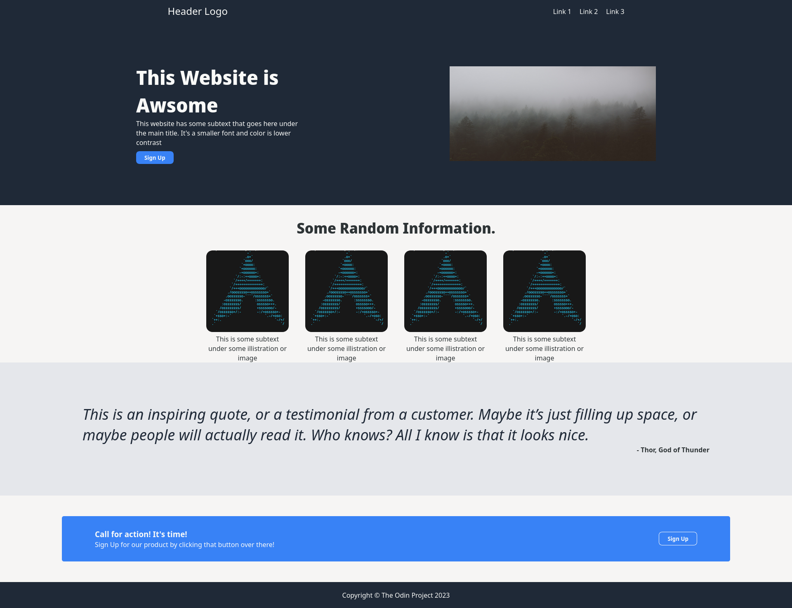
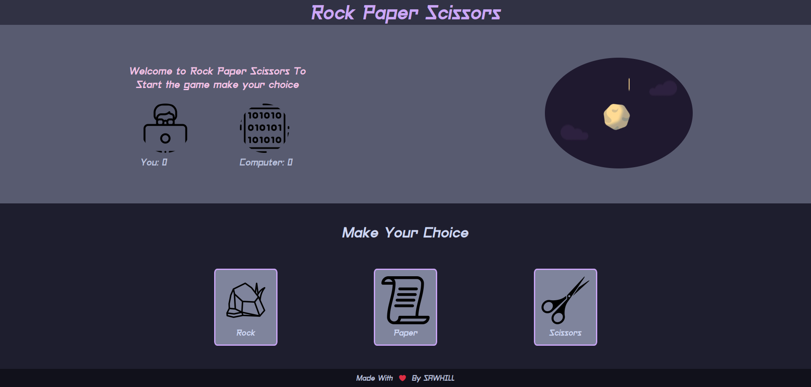
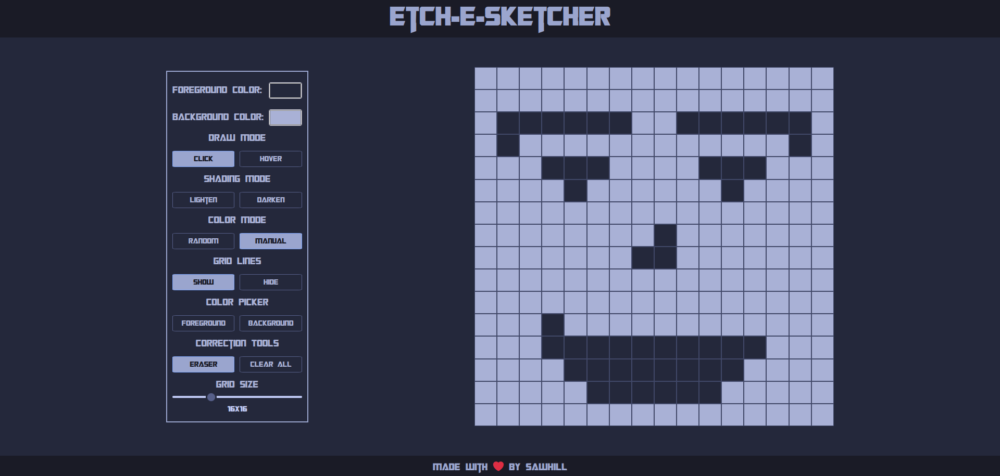

# The Odin Project Learnings

Welcome to my repository for exercises and projects completed during my journey through The Odin Project. Here, you'll find a collection of hands-on coding challenges and projects that I've worked on to enhance my programming skills.

## Live Demos

Explore the following projects with their live demos:

### Landing Page Project

Create a visually appealing landing page.

[Live Demo](https://name.github.io/The-Odin-Project-Learnings/landing_page_project/)

## Rock Paper Scissors

Test your luck against the computer in this classic game.

[Live Demo](https://name.github.io/The-Odin-Project-Learnings/rps_project/)

## Etch-E-Sketch

Get creative and draw your own pixel art.

[Live Demo](https://name.github.io/The-Odin-Project-Learnings/etch-e-sketch/)

